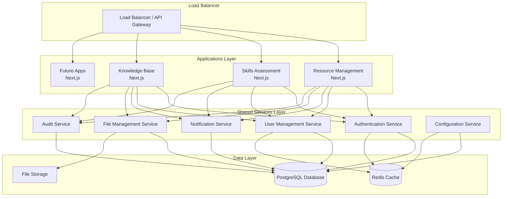
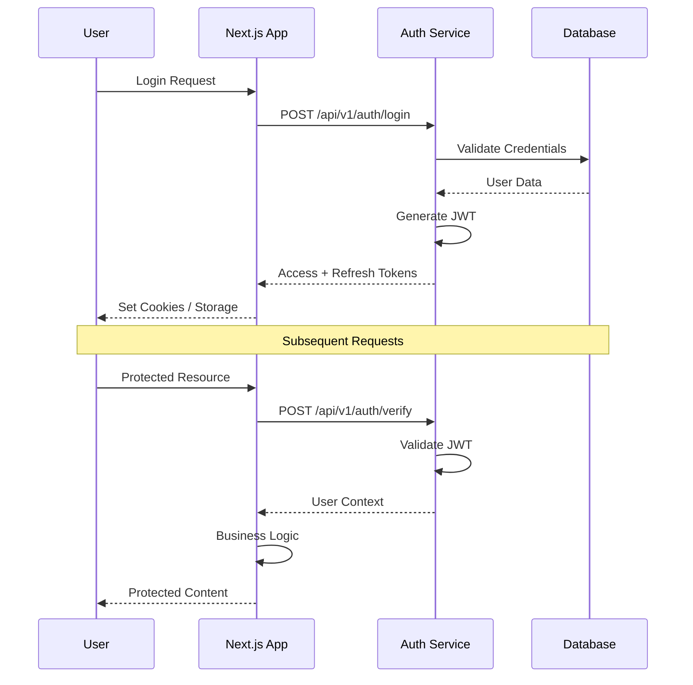
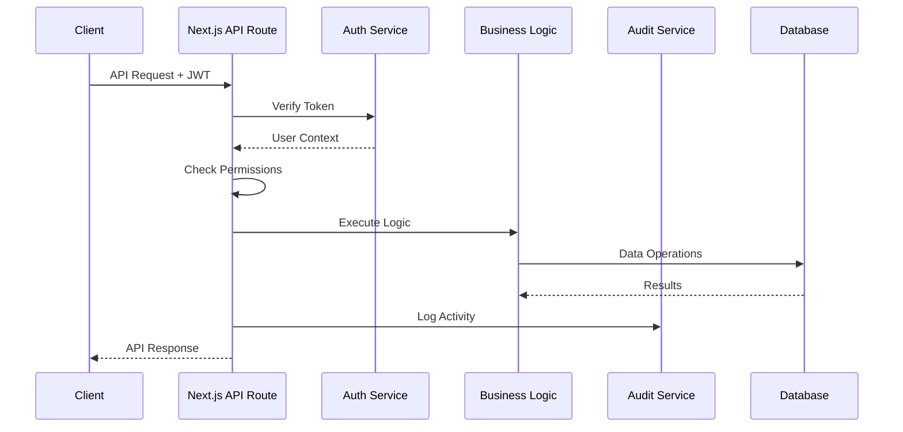
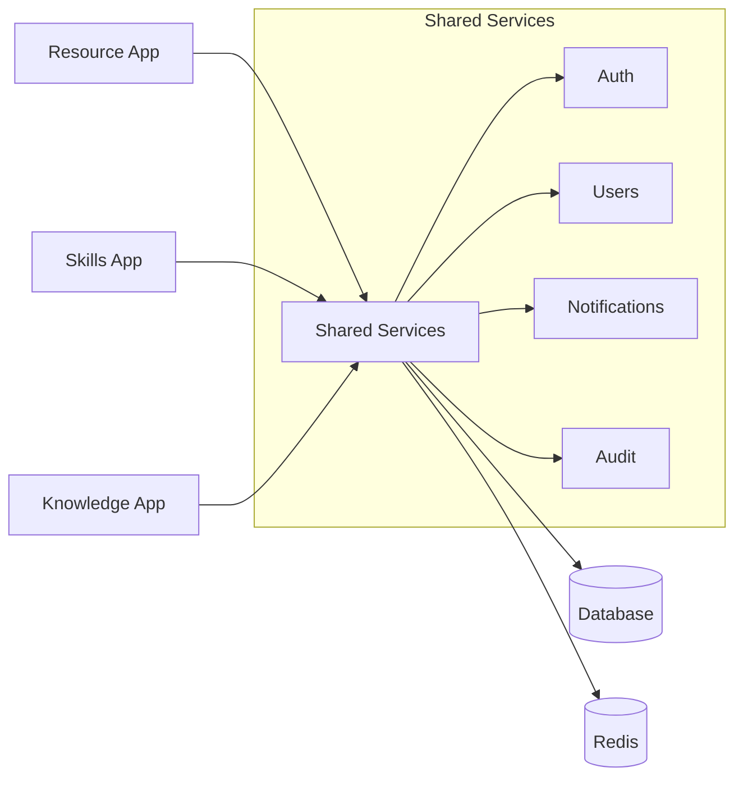

# Architecture Overview

> Comprehensive overview of the Internal Tools Platform architecture, design principles, and implementation patterns.

## 🎯 System Overview

The Internal Tools Platform is designed as a **microservices architecture** with centralized shared services and self-contained Next.js applications. This architecture enables rapid development of internal tools while maintaining consistency and scalability.

### Core Principles

- **API-First**: All functionality exposed via well-documented APIs
- **Self-Contained Applications**: Each app operates independently
- **Shared Services**: Common functionality centralized
- **Developer Experience**: Fast onboarding and consistent patterns
- **Future-Ready**: Packageable services and SDK generation
- **Platform Agnostic**: Deploy anywhere with containers

## 🏗️ High-Level Architecture



## 🧩 Component Architecture

### 1. Application Layer (Next.js Apps)

Each Next.js application is **self-contained** with its own:
- Frontend UI and user experience
- API routes for app-specific logic
- Database tables for app-specific data
- Business logic and workflows
- Testing and deployment pipeline

**Key Characteristics:**
- **Independent Deployment**: Can be deployed separately
- **Technology Flexibility**: Can use different UI libraries if needed
- **Team Ownership**: Different teams can own different apps
- **Fault Isolation**: App failures don't affect other apps
- **Performance Optimization**: App-specific optimizations

**Communication Pattern:**
```typescript
Next.js App → HTTP API → Shared Services → Database
```

### 2. Shared Services Layer (NestJS)

Centralized services providing common functionality:

#### Authentication Service
```typescript
@Module({
  controllers: [AuthController],
  providers: [AuthService, JwtService],
  exports: [AuthService]
})
export class AuthModule {}
```

**Responsibilities:**
- JWT token generation and validation
- User authentication (login/logout)
- Password management and policies
- Session management
- SSO integration (future)
- Multi-factor authentication (future)

#### User Management Service
**Responsibilities:**
- User profile management
- Organization and team management
- Role-based access control (RBAC)
- User preferences and settings
- Department and skill tracking

#### Notification Service
**Responsibilities:**
- Email notifications (transactional and bulk)
- In-app notifications
- Slack/Teams integration
- SMS notifications (future)
- Notification templates and preferences

#### File Management Service
**Responsibilities:**
- File upload and storage
- Image processing and optimization
- Document preview generation
- Access control and sharing
- Version management

#### Audit Service
**Responsibilities:**
- Activity logging across all applications
- Compliance reporting
- Data retention policies
- Security event tracking
- Performance metrics

#### Configuration Service
**Responsibilities:**
- Organization settings
- Feature flags
- Application configuration
- Theme and branding
- Integration settings

### 3. Data Layer

#### PostgreSQL Database
**Multi-tenant design** with organization-scoped data:

```sql
-- Core tables managed by shared services
organizations → users → user_roles → roles
                ↓
            audit_logs, notifications, files

-- App-specific tables
resources, bookings (Resource Management)
skills, assessments (Skills Assessment)  
articles, categories (Knowledge Base)
```

#### Redis Cache
**Usage patterns:**
- Session storage
- API response caching
- Rate limiting
- Real-time data (future)

#### File Storage
**Flexible storage backend:**
- Local filesystem (development)
- AWS S3 (production)
- Google Cloud Storage (alternative)
- Azure Blob Storage (alternative)

## 🔄 Data Flow Patterns

### 1. Authentication Flow



### 2. API Request Flow



### 3. Cross-App Communication



## 🛡️ Security Architecture

### 1. Authentication & Authorization

**JWT-Based Authentication:**
```typescript
interface JWTPayload {
  userId: string;
  orgId: string;
  email: string;
  iat: number;
  exp: number;
}
```

**Permission System:**
```typescript
// Role-based permissions
const permissions = [
  'users:read', 'users:create', 'users:update', 'users:delete',
  'resources:read', 'resources:create', 'resources:update',
  'audits:read', 'settings:update'
];
```

**Request Authorization:**
```typescript
// Every API request includes org context
interface RequestContext {
  orgId: string;
  userId: string;
  permissions: string[];
  ipAddress: string;
  userAgent: string;
}
```

### 2. Data Isolation

**Multi-Tenant Database Design:**
- All data scoped by `org_id`
- Row-level security policies
- Automatic data filtering
- Shared services enforce isolation

### 3. API Security

**Request Validation:**
- JWT token validation
- Input sanitization
- Rate limiting
- CORS policies
- API key authentication (service-to-service)

## 📊 Scalability Architecture

### 1. Horizontal Scaling

**Application Scaling:**
```yaml
# Kubernetes example
apiVersion: apps/v1
kind: Deployment
metadata:
  name: resource-management
spec:
  replicas: 3  # Scale based on demand
  selector:
    matchLabels:
      app: resource-management
```

**Service Scaling:**
```yaml
apiVersion: apps/v1
kind: Deployment
metadata:
  name: shared-services
spec:
  replicas: 5  # More instances for high demand
```

### 2. Database Scaling

**Read Replicas:**
- Master for writes
- Read replicas for queries
- Connection pooling
- Query optimization

**Caching Strategy:**
```typescript
// Multi-level caching
class CacheService {
  // L1: In-memory cache
  private memoryCache = new Map();
  
  // L2: Redis cache
  private redisClient = new Redis();
  
  // L3: Database
  async get(key: string) {
    // Check memory first
    let value = this.memoryCache.get(key);
    if (value) return value;
    
    // Check Redis
    value = await this.redisClient.get(key);
    if (value) {
      this.memoryCache.set(key, value);
      return value;
    }
    
    // Fallback to database
    value = await this.database.get(key);
    await this.redisClient.set(key, value);
    this.memoryCache.set(key, value);
    return value;
  }
}
```

### 3. Performance Optimization

**Next.js Optimizations:**
- Static generation for public content
- Server-side rendering for dynamic content
- API route optimization
- Image optimization
- Bundle splitting

**Database Optimizations:**
- Proper indexing strategy
- Query optimization
- Connection pooling
- Prepared statements

## 🔧 Development Architecture

### 1. Monorepo Structure

```
internal-tools-platform/
├── packages/          # Shared code
├── services/          # Backend services
├── apps/             # Frontend applications
├── infrastructure/   # Deployment configs
├── tools/           # Development tools
└── docs/            # Documentation
```

**Benefits:**
- Shared code and types
- Coordinated releases
- Unified tooling
- Cross-team collaboration

### 2. Package Management

**Workspace Dependencies:**
```json
{
  "workspaces": [
    "packages/*",
    "services/*", 
    "apps/*"
  ]
}
```

**Shared Packages:**
- `@shared/types` - TypeScript definitions
- `@shared/client` - API client library
- `@shared/ui` - UI components
- `@shared/config` - Configuration utilities

### 3. Development Workflow

**Local Development:**
```bash
npm run setup:dev  # One command setup
npm run dev        # Start all services
npm run test       # Run all tests
```

**CI/CD Pipeline:**
- Automated testing
- Code quality checks
- Security scanning
- Deployment automation

## 🚀 Deployment Architecture

### 1. Environment Strategy

**Development:**
- Docker Compose
- Local services
- Hot reload
- Debug tools

**Staging:**
- Kubernetes cluster
- Shared databases
- Feature testing
- Performance testing

**Production:**
- Kubernetes cluster
- High availability
- Monitoring
- Backup systems

### 2. Container Strategy

**Base Images:**
```dockerfile
# Shared base image
FROM node:18-alpine AS base
RUN npm install -g npm@latest

# Development image
FROM base AS development
ENV NODE_ENV=development

# Production image  
FROM base AS production
ENV NODE_ENV=production
RUN addgroup --system --gid 1001 nodejs
RUN adduser --system --uid 1001 nextjs
USER nextjs
```

### 3. Service Discovery

**DNS-Based Discovery:**
```yaml
# Kubernetes services
apiVersion: v1
kind: Service
metadata:
  name: shared-services
spec:
  selector:
    app: shared-services
  ports:
  - port: 3000
    targetPort: 3000
```

## 📈 Monitoring Architecture

### 1. Observability Stack

**Metrics:** Prometheus + Grafana
**Logging:** ELK Stack (Elasticsearch, Logstash, Kibana)
**Tracing:** Jaeger (future)
**Alerting:** Prometheus AlertManager

### 2. Application Monitoring

**Health Checks:**
```typescript
@Get('health')
async health(): Promise<HealthCheckResult> {
  return {
    status: 'ok',
    timestamp: new Date().toISOString(),
    version: process.env.npm_package_version,
    dependencies: {
      database: await this.databaseHealth(),
      redis: await this.redisHealth(),
    }
  };
}
```

**Performance Metrics:**
```typescript
// Custom metrics
const httpDuration = new Histogram({
  name: 'http_request_duration_seconds',
  help: 'Duration of HTTP requests in seconds',
  labelNames: ['method', 'route', 'status_code']
});
```

## 🔮 Future Architecture Considerations

### 1. Event-Driven Architecture

**Message Queues:**
- Redis Streams for real-time events
- Event sourcing for audit trails
- CQRS pattern for complex queries

### 2. Microservices Evolution

**Service Mesh:**
- Istio for service communication
- Traffic management
- Security policies
- Observability

### 3. Edge Computing

**CDN Integration:**
- Static asset optimization
- Edge API caching
- Geographic distribution

## 📚 Architecture Guidelines

### 1. Design Principles

- **Single Responsibility**: Each service has one clear purpose
- **Loose Coupling**: Services communicate via well-defined APIs
- **High Cohesion**: Related functionality grouped together
- **Fail Fast**: Early validation and error detection
- **Graceful Degradation**: System continues operating when components fail

### 2. API Design Standards

- RESTful endpoints with consistent naming
- OpenAPI documentation for all APIs
- Versioning strategy for breaking changes
- Standard error response formats
- Pagination for list endpoints

### 3. Database Design Standards

- Multi-tenant with org_id scoping
- Proper indexing for performance
- Foreign key constraints for integrity
- Audit trails for sensitive data
- Backup and recovery procedures

## 🤝 Team Architecture

### 1. Ownership Model

**Platform Team:**
- Shared services
- Infrastructure
- Developer tools
- Documentation

**Application Teams:**
- Individual Next.js apps
- App-specific features
- User experience
- App testing

### 2. Collaboration Patterns

**Shared Responsibilities:**
- API contract definitions
- Security standards
- Performance requirements
- Quality gates

**Independent Responsibilities:**
- UI/UX design
- Business logic
- App-specific testing
- Feature delivery

This architecture provides a solid foundation for building scalable, maintainable internal tools while enabling rapid development and team autonomy.